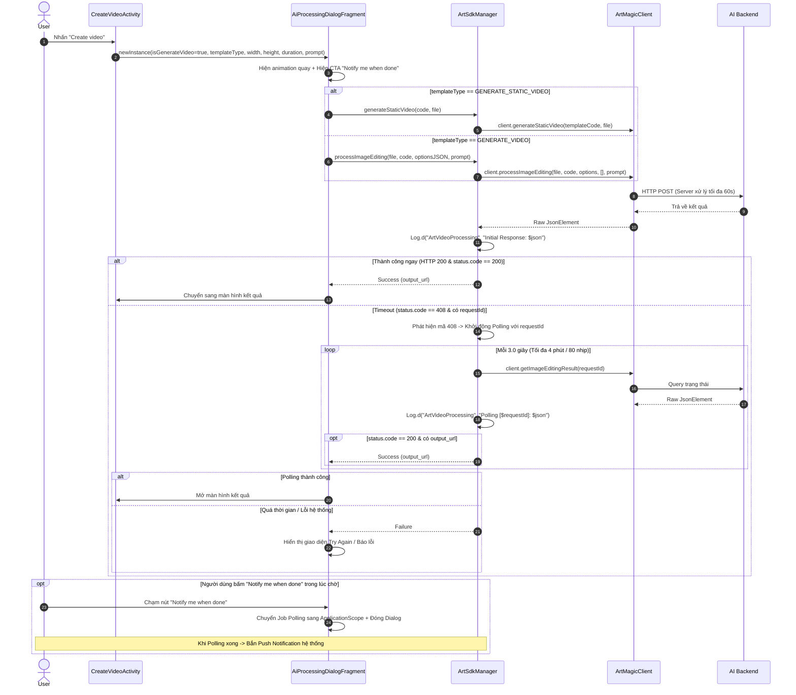
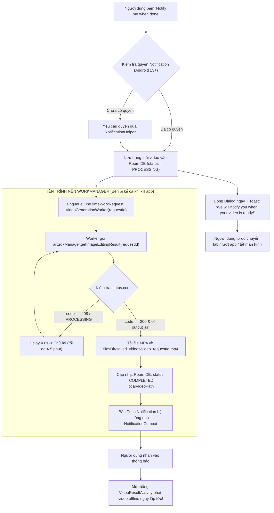
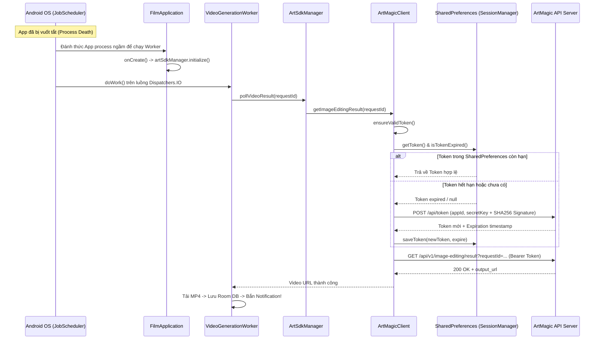

# Kế Hoạch Triển Khai: Màn Hình Create Video (AI Video Generator)

Dự án: **893-PHOTO-ART** (Mã dự án: `893-PHOTO-ART`, App ID: `CODE12_893`).  
Quy chuẩn: **Tuyệt đối không Jetpack Compose**. Bắt buộc dùng **Android XML Layouts + Material Design 3 (M3) + View Binding + MVVM**.  
Figma Design: Node `4028:1033` ("Create - dynamic input 5"), File key `LpZ7zpoel2cIq3vER2RDTY` ("[CODE12] 762Y VIDEO GENERATOR (Copy)").

---

## 1. TỔNG QUAN YÊU CẦU & BẢN CHẤT TÍNH NĂNG

Màn hình **Create Video** được xây dựng dựa trên phong cách Dark Glassmorphism điện ảnh của ứng dụng, kế thừa luồng nghiệp vụ của màn Create Photo nhưng bổ sung và chuyên biệt hóa các trường điều khiển tạo video AI:

1. **AI Prompt**: Khung nhập mô tả Textarea co giãn linh hoạt, nút Magic Wand (`ic_magic_wand`) gợi ý prompt chuyển động/ánh sáng điện ảnh, bộ đếm ký tự.
2. **Aspect Ratio (Tỉ lệ khung hình)**: Cho phép chọn 3 tỉ lệ `9:16`, `16:9`, `1:1`.
3. **Duration (Thời lượng video - MỚI)**: Cho phép chọn 3 mốc thời lượng `5S`, `8S`, `10S`.
4. **Layout Responsive theo Tỷ lệ (Ratio-based UI)**: Tuyệt đối không dùng kích thước chiều cao cố định (hardcoded dp) cho các card, thay thế bằng tỷ lệ quang học (`layout_constraintDimensionRatio`) và phân bố trọng số (`layout_weight="1"`).
5. **Cải tiến Dialog AI Loading (`AiProcessingDialogFragment`)**:
   - Loại bỏ link "View Privacy Policy".
   - Nút CTA **"Notify me when done"** chỉ hiển thị khi tạo Video để hỗ trợ render ngầm (tự động ẩn khi tạo Photo).
6. **Tích hợp API SDK theo `templateType` & Output 720p**:
   - `GENERATE_STATIC_VIDEO`: Gọi `client.generateStaticVideo(templateCode, inputFile)`.
   - `GENERATE_VIDEO`: Gọi `client.processImageEditing(...)` với options chứa `width`, `height`, `duration`.
7. **Chiến lược Xử lý Timeout (60s) & Polling (1 - 3 phút)**:
   - Backend có timeout tối đa 60s và trả về mã `408` kèm `requestId`.
   - Client nâng coroutine timeout ban đầu lên 75s để không ngắt trước server.
   - Khi gặp mã `408`, tự động kích hoạt Polling qua `client.getImageEditingResult(requestId)` với chu kỳ 3.0s, ngân sách tối đa 4 phút.
   - Ghi log đầy đủ raw JSON Response ra Logcat với tag `ArtVideoProcessing`.

---

## 2. QUY CHUẨN THAM SỐ API & OPTIONS (OUTPUT 720P)

Khi gọi hàm `client.processImageEditing(...)` cho template sinh video, tham số `options` là chuỗi JSON chứa `width`, `height` (dạng String) dựa trên tỷ lệ được chọn và `duration`:

### Bảng Mapping Tỉ lệ & Độ phân giải:

| Tỉ lệ hiển thị | Ý nghĩa khung hình | `width` | `height` | Tỷ lệ quang học | Preset 720p gốc |
| :---: | :---: | :---: | :---: | :---: | :---: |
| **`9:16`** *(Mặc định)* | Video dọc (TikTok, Reels, Shorts) | `"360"` | `"640"` | $9 : 16 = 0.5625$ | `"720"` x `"1280"` |
| **`16:9`** | Video ngang (Cinema, YouTube) | `"640"` | `"360"` | $16 : 9 = 1.7778$ | `"1280"` x `"720"` |
| **`1:1`** | Video vuông (Square Feed) | `"640"` | `"640"` | $1 : 1 = 1.0$ | `"720"` x `"720"` |

### Chuỗi JSON `options` chuẩn:
```json
{
  "width": "360",
  "height": "640",
  "duration": "5"
}
```

*Ghi chú*: Trong code Kotlin, xây dựng cấu hình linh hoạt (hỗ trợ chuyển đổi giữa hệ 360x640 và 720x1280 thông qua hằng số `ArtVideoResolutionConfig`).

---

## 3. CƠ CHẾ TIMEOUT & POLLING CHO VIDEO (1 - 3 PHÚT)



### Các quy tắc cốt lõi:
1. **Timeout Coroutine**: Đặt `75000L` (75 giây) ở request đầu, ngăn chặn việc coroutine bị hủy trước thời điểm 60s của backend.
2. **Bắt mã 408 đa kiểu**:
   ```kotlin
   fun isTimeoutCode(codeElem: JsonElement?): Boolean {
       if (codeElem == null || codeElem.isJsonNull) return false
       return try {
           codeElem.asInt == 408
       } catch (_: Exception) {
           codeElem.asString.trim() == "408"
       }
   }
   ```
3. **Trích xuất `requestId` đa tầng**:
   - Quét tại `data.requestId`
   - Quét tại `data.data.requestId`
   - Quét tại `root.requestId`
4. **Vòng lặp Polling an toàn**:
   - Interval: `3000ms`.
   - Timeout tổng: `240s` (4 phút).
   - Chịu lỗi mạng: Cho phép bỏ qua tối đa 3 lần lỗi `SocketTimeoutException` / rớt mạng liên tiếp trong lúc poll.
5. **Ghi Logcat chuẩn**: Toàn bộ raw JSON được log với tag `ArtVideoProcessing` ở mức `Log.d` để phục vụ đối soát và phân tích response thực tế từ server.

---

## 4. QUY CHUẨN THIẾT KẾ GIAO DIỆN TỶ LỆ (RATIO-BASED XML)

Layout `app/src/main/res/layout/activity_create_video.xml` được xây dựng bằng `<ScreenScaffold>` làm root ViewGroup:

### 4.1. Header: `CinemaTopAppBar`
- Title: `@string/create_video_title` ("Create video", Poppins Bold 22sp).
- Nút Back: Nút tròn mờ glassmorphism với `<inset>` chống vỡ viền.
- Nhận safe display cutout insets tự động từ `ScreenScaffold`.

### 4.2. Vùng chọn ảnh: `layoutUploadArea`
- Thay vì fix `250dp`, sử dụng tỷ lệ chữ nhật chuẩn:
  ```xml
  <androidx.constraintlayout.widget.ConstraintLayout
      android:id="@+id/layoutUploadArea"
      android:layout_width="match_parent"
      android:layout_height="0dp"
      android:layout_marginTop="8dp"
      app:layout_constraintDimensionRatio="16:11">
  ```
- Trạng thái trống: Nét đứt 1.5dp, icon `ic_gallery_add_linear`, text hướng dẫn.
- Trạng thái đã chọn: `MaterialCardView` bo góc 16dp, viền lavender `#BAC6FF` 1.5dp, ảnh preview kèm badge "Change" góc trên bên phải.

### 4.3. Danh sách Template: `rvTemplates`
- Header: `@string/create_photo_select_template` ("Select template").
- `RecyclerView` cuộn ngang, padding start/end 16dp, `clipToPadding="false"`.
- Item template: Kích thước tỷ lệ 144dp x 189dp, bo góc 16dp, gradient chân ảnh và viền active lavender khi chọn.

### 4.4. Khung AI Prompt:
- Header: `@string/create_photo_ai_prompt` ("AI Prompt").
- Container: Nền kính mờ `@drawable/bg_glass_card_rounded`, bo góc 16dp, `minHeight="130dp"`, `layout_height="wrap_content"`.
- `TextInputEditText`: Hint `"Describe the atmosphere, movement, and visual style..."`, chữ trắng, không giới hạn cố định một dòng.
- Nút Magic Wand (`btnMagicPrompt`): Kích thước 36x36dp, icon `@drawable/ic_magic_wand` tint `#99F7FF`, đặt ở góc dưới cùng bên phải (`gravity="bottom|end"`).

### 4.5. Khung Aspect Ratio:
- Header: `@string/create_photo_aspect_ratio` ("Aspect Ratio").
- Container: `LinearLayout` ngang với 3 nút chia đều bằng `layout_weight="1"`, khoảng cách 12dp.
- Chiều cao dùng `minHeight="84dp"` và padding dọc 12dp, ngang 8dp.
- 3 tỉ lệ: `9:16`, `16:9`, `1:1`.
- State Selector: Nền `@drawable/bg_aspect_ratio_card`, text/icon `@color/aspect_ratio_selector`.

### 4.6. Khung Duration (Thành phần mới):
- Header: `@string/create_video_duration` ("Duration").
- Container: `LinearLayout` ngang với 3 nút chia đều bằng `layout_weight="1"`, khoảng cách 12dp.
- Nút: Padding dọc 16dp, ngang 8dp, bo góc 16dp, bọc thẻ `<inset>` theo chuẩn mục 3.7 AGENTS.md.
- 3 mốc: `5S`, `8S`, `10S`.
- Nền `@drawable/bg_duration_card`, chữ `@color/duration_selector` (Active `#BAC6FF`, Inactive `#626262`).

### 4.7. Thanh CTA dính đáy (Sticky CTA Bar):
- `layoutBottomBar`: Chiều cao bao ngoài 80dp chứa Nine-Patch `@drawable/bg_btn_primary_pill_glow`.
- Nút "Create video" dạng Pill Button chiều cao solid 56dp, chữ trắng Poppins SemiBold 16sp.
- Nhận safe gesture navigation insets tự động từ `ScreenScaffold` (`app:scaffoldBottomView="@id/layoutBottomBar"`).

---

## 5. TỔ CHỨC CẤU TRÚC THƯ MỤC & CODE TRONG PROJECT

```
app/src/main/
├── AndroidManifest.xml                                  [✏️ Khai báo CreateVideoActivity]
├── java/com/aiart/photo/video/generator/
│   ├── common/navigation/
│   │   └── AppNavigator.kt                              [✏️ Bổ sung openCreateVideo(...)]
│   │
│   ├── data/sdk/
│   │   └── ArtSdkManager.kt                             [✏️ generateStaticVideo, getImageEditingResult, polling 408]
│   │
│   └── ui/
│       ├── create/
│       │   ├── adapter/                                 [📦 Shared Module tái sử dụng]
│       │   │   └── SelectTemplateAdapter.kt             [Chuyển từ photo/adapter ra đây]
│       │   │
│       │   ├── video/                                   [✨ Module Mới hoàn toàn]
│       │   │   ├── CreateVideoActivity.kt               [Màn hình tạo video]
│       │   │   └── CreateVideoViewModel.kt              [State: image, width/height, duration, prompt]
│       │   │
│       │   ├── photo/                                   [♻️ Cập nhật import Adapter]
│       │   │   ├── CreatePhotoActivity.kt
│       │   │   └── CreatePhotoViewModel.kt
│       │   │
│       │   ├── loading/                                 [🔄 Loading & Polling]
│       │   │   ├── AiProcessingDialogFragment.kt        [✏️ Bỏ Privacy Policy, nút Notify riêng cho Video]
│       │   │   └── AiErrorDialogFragment.kt             [Dialog báo lỗi và Retry]
│       │   │
│       │   └── result/
│       │       └── PhotoResultActivity.kt               [Cập nhật import Adapter]
│       │
│       ├── home/HomeFragment.kt                         [✏️ Route template.isVideo -> openCreateVideo]
│       └── discover/DiscoverFragment.kt                 [✏️ Route template.isVideo -> openCreateVideo]
│
└── res/
    ├── layout/
    │   ├── activity_create_video.xml                    [✨ Layout responsive theo tỉ lệ]
    │   └── dialog_ai_processing.xml                     [✏️ Xóa tvPrivacyPolicyLink]
    │
    ├── drawable/
    │   ├── bg_duration_card.xml                         [✨ Selector thẻ duration có <inset>]
    │   └── bg_aspect_ratio_card.xml                     [Tái sử dụng cho Aspect Ratio]
    │
    ├── color/
    │   └── duration_selector.xml                        [✨ State list màu chữ duration #BAC6FF / #626262]
    │
    └── values/
        └── strings.xml                                  [✏️ Strings: create_video_*]
```

---

---

## 6. THIẾT KẾ MÀN HÌNH VIDEO RESULT & CÁC NÚT CTA (FULLSCREEN + 9-PATCH + BLURVIEW)

### 6.1. Video Toàn Màn Hình (Edge-to-Edge Fullscreen Playback)
- **Cấu trúc Layout**: `androidx.media3.ui.PlayerView` được neo sát 4 cạnh của màn hình (`top=0`, `bottom=0`, `start=0`, `end=0`), chạy ngầm bên dưới toàn bộ thanh StatusBar, NavigationBar và các nút điều khiển.
- **Tỉ lệ khung hình điện ảnh**: Thiết lập `app:resize_mode="zoom"` (hoặc `fixed_width`) để video phủ trọn vẹn màn hình điện thoại (tương tự trải nghiệm TikTok/Reels/Shorts).
- **Lớp phủ Scrim Gradient**:
  - Đỉnh màn hình: Gradient tối nhẹ để nút Back tròn luôn sắc nét trên nền video sáng.
  - Đáy màn hình (`Bottom Content Overlay`): Gradient đen từ dưới lên (`#E60F0F0F` $\to$ `#000F0F0F`, cao 260dp) để tiêu đề, progress bar và nút CTA nổi bật rõ ràng.

### 6.2. Phân tích Khả thi Kỹ thuật của các Nút CTA (XML vs 9-Patch vs BlurView)

| Nút / Thành phần UI | Hiệu ứng trên Figma | XML thông thường có làm được không? | Giải pháp kỹ thuật Bắt buộc | Chi tiết triển khai |
| :--- | :--- | :---: | :---: | :--- |
| **Nút CTA chính đáy** (`Try another template`) | Solid Pill 56dp, gradient tím hồng, **Outer Glow tán xạ trắng 12dp** + **Inner Highlight 6.7px** | ❌ **KHÔNG THỂ** (XML `<shape>` không hỗ trợ outer/inner gaussian glow) | **Bắt buộc dùng Nine-Patch (`.9.png`)** | Tái sử dụng `@drawable/bg_btn_primary_pill_glow.9.png` (View cao 80dp = 56dp solid + 2x12dp glow, padding bù trừ quang học theo mục 3.8 AGENTS.md). |
| **Cột 4 nút Action bên phải** (`Re-gen`, `Save`, `Share`, `More`) | Khung 48x48dp, bo góc 12dp, viền kính mỏng 1px, **`backdropFilter: blur(20px)` làm mờ video chuyển động bên dưới** | ❌ **KHÔNG THỂ** (XML tĩnh chỉ vẽ được màu bán trong suốt, không làm mờ được video động bên dưới) | **Bắt buộc dùng `BlurView` (`eightbitlab.com.blurview.BlurView`)** | Mỗi nút bọc trong `BlurView` 48x48dp, bo góc 12dp qua `ViewOutlineProvider`, setup với root video: `setupWith(rootVideo).setBlurRadius(20f).setBlurAutoUpdate(true)`. Bên trong lót drawable viền `<inset>` `@drawable/bg_glass_action_button.xml`. |
| **Nút Back trên đỉnh** (`Button - Go back`) | Tròn 40x40dp, viền hairline 1px, làm mờ video bên dưới | ❌ Bị thô nếu chỉ dùng XML phẳng | **Dùng `BlurView` tròn 40x40dp** (hoặc `@drawable/bg_btn_circle_translucent` kết hợp `BlurView`) | Tự động làm mờ dòng chảy video bên dưới, viền chống vỡ nét bằng `<inset android:inset="@dimen/stroke_hairline">`. |
| **BottomSheet More Action** (`289:881`) | Nền kính tối (`Noti bg`), bo góc đỉnh 40dp, `backdropFilter: blur(20px)` | ⚠️ XML chỉ giả lập được màu nền tối #B3000000 | **Dùng XML Glass Dark Shape kết hợp làm mờ nền Dialog** | Sử dụng `@drawable/bg_bottom_sheet_glass.xml` có bo góc 40dp, viền hairline `<inset>`, thiết lập dim amount 0.7f cho Window dialog. |

### 6.3. Chi tiết Cột Nút Action bên phải (`Right Side Action Vertical Bar`):
- `btnRegen`: Nút **"Re-gen"** (Icon xoay + Text "Re-gen") $\implies$ Quay về màn tạo video với prompt và template giữ nguyên.
- `btnSave`: Nút **"Save"** (Icon Bookmark + Text "Save") $\implies$ Lưu video vào Room Database nội bộ (chuyển sang icon active đã lưu).
- `btnShare`: Nút **"Share"** (Icon Share + Text "Share") $\implies$ Chia sẻ trực tiếp file MP4 qua `FileProvider` (không tải lại mạng).
- `btnMore`: Nút **"More"** (Icon 3 chấm) $\implies$ Mở `VideoMoreActionBottomSheet` (`289:881`).

### 6.4. Chi tiết BottomSheet More Action (Node `289:881`):
- Nút **"Download Video"**: Bọc trong `BlurView` / glass card, khi nhấn sẽ copy file từ `localVideoPath` sang Thư viện ảnh thiết bị qua `MediaStore` (tức thì 0.1s, không tốn data).
- Nút **"Report Video"**: Mở dialog phản hồi nội dung.

---

## 7. CƠ CHẾ PRE-DOWNLOAD & SINGLE SOURCE OF TRUTH (CHỐNG TẢI 2 LẦN)

### 7.1. Pre-download Video trước khi mở màn Result:
- **Vấn đề**: Nếu truyền trực tiếp URL trực tuyến vào ExoPlayer, video loop ngắn (5-10s) sẽ bị trễ mạng (buffering spinner), giật lag ở các vòng loop đầu, và link S3/CDN có thời hạn hết hạn (TTL).
- **Giải pháp**:
  - Ngay khi AI polling thành công và có `output_url`, giữ Dialog loading thêm 1-2 giây với thông điệp: `"Preparing your video..."`.
  - Coroutine tải trọn vẹn file `.mp4` về thư mục nội bộ an toàn:
    `val targetFile = File(context.filesDir, "generated_videos/video_${System.currentTimeMillis()}.mp4")`
  - Khi tải xong $\implies$ Đóng Dialog và mở `VideoResultActivity` với `localVideoPath = targetFile.absolutePath`.
  - **Kết quả**: Player phát ngay lập tức trong 0ms, không độ trễ, loop mượt mà 100%.

### 7.2. Nguyên tắc Single Source of Truth cho Download & Share:
- Vì tệp MP4 đã nằm sẵn tại `localVideoPath`:
  - **Tính năng Download Video (More BottomSheet)**: Sử dụng Android `MediaStore.Video.Media` API để copy bytes từ `localVideoPath` sang thư mục công khai của thiết bị (`Movies/PhotoArt` hoặc `DCIM/PhotoArt`).
    - *Thời gian thực thi*: **~0.1 giây**, hoàn toàn **OFFLINE**, không tốn bất kỳ byte băng thông mạng nào!
    - Hiển thị Toast thông báo: *"Video saved to Gallery"*.
  - **Tính năng Share (Nút Share)**: Dùng `FileProvider.getUriForFile` bọc trực tiếp `File(localVideoPath)` và bắn `Intent.ACTION_SEND` với MIME type `video/mp4`.
    - Mở ngay khay chia sẻ hệ thống (TikTok, Instagram Stories, WhatsApp, Telegram, Messenger...).
    - **Không cần gọi bất kỳ API tải lại nào!**

---

## 8. THIẾT KẾ DATA LAYER CHO MÀN DANH SÁCH SAVED (ROOM DATABASE)

Để màn hình Saved / Library có thể lấy danh sách tác phẩm video đã tạo ra hiển thị ngay tức thì mà không phụ thuộc vào link trực tuyến hết hạn:

### 8.1. Entity: `SavedVideoEntity`
```kotlin
@Entity(tableName = "saved_videos")
data class SavedVideoEntity(
    @PrimaryKey(autoGenerate = true)
    val id: Long = 0,
    val templateCode: String,
    val templateName: String,
    val templateCategory: String = "",
    val templateCoverUrl: String = "",
    val prompt: String = "",
    val aspectRatio: String = "9:16",
    val duration: String = "5S",
    val localVideoPath: String,            // Đường dẫn file MP4 nội bộ (Permanent Storage)
    val remoteVideoUrl: String,            // URL trực tuyến ban đầu (Fallback)
    val createdAt: Long = System.currentTimeMillis(),
    val isSaved: Boolean = true
)
```

### 8.2. DAO: `SavedVideoDao`
```kotlin
@Dao
interface SavedVideoDao {
    @Query("SELECT * FROM saved_videos ORDER BY createdAt DESC")
    fun getAllSavedVideos(): Flow<List<SavedVideoEntity>>

    @Insert(onConflict = OnConflictStrategy.REPLACE)
    suspend fun insertVideo(video: SavedVideoEntity): Long

    @Query("DELETE FROM saved_videos WHERE id = :id")
    suspend fun deleteById(id: Long)

    @Query("SELECT * FROM saved_videos WHERE localVideoPath = :path LIMIT 1")
    suspend fun findByPath(path: String): SavedVideoEntity?
}
```
*Tích hợp*: Đăng ký `SavedVideoEntity` và `savedVideoDao()` vào `AppDatabase.kt`.

---

---

## 9. NGHIÊN CỨU & THIẾT KẾ CHI TIẾT "NOTIFY ME WHEN DONE" (WORKMANAGER & SDK TOKEN AUTOMATION)

### 9.1. Cơ Chế Quản Lý Token của SDK (`ArtMagicClient`):
- Qua phân tích bytecode `lib-release.aar`, SDK sở hữu cơ chế **Token tự quản lý 100%** (`cachedToken` + `ensureValidToken` + `SessionManager`):
  - Khi bất kỳ hàm nào của SDK được gọi (như `client.getImageEditingResult(requestId)` hoặc `client.request(...)`), SDK tự động kiểm tra tính hợp lệ của token, tự động fetch token mới qua `PostApiTokenModel(appId, secretKey)` nếu hết hạn, và tự động ký chữ ký số `SignatureHelpers` vào Request Header.
  - **Ý nghĩa kiến trúc cực kỳ quan trọng**: Phía ứng dụng (App Client) **hoàn toàn KHÔNG cần truyền accessToken thủ công hay lo lắng token bị hết hạn**. Bất kỳ tiến trình nền nào (WorkManager hay Service) đều có thể gọi hàm SDK `getImageEditingResult` một cách độc lập và an toàn 100%!

### 9.2. Luồng Xử Lý Khi Người Dùng Bấm "Notify me when done":



### 9.3. Thiết kế `VideoGenerationWorker`:
```kotlin
@HiltWorker
class VideoGenerationWorker @AssistedInject constructor(
    @Assisted private val context: Context,
    @Assisted private val params: WorkerParameters,
    private val artSdkManager: ArtSdkManager,
    private val savedVideoDao: SavedVideoDao
) : CoroutineWorker(context, params) {

    override suspend fun doWork(): Result = withContext(Dispatchers.IO) {
        val requestId = inputData.getString(KEY_REQUEST_ID) ?: return@withContext Result.failure()
        val templateName = inputData.getString(KEY_TEMPLATE_NAME) ?: "AI Video"
        
        // Polling qua hàm SDK (Token SDK tự quản lý hoàn toàn)
        val pollingResult = artSdkManager.pollVideoResult(requestId = requestId, maxTimeoutMs = 240_000L)
        
        pollingResult.fold(
            onSuccess = { outputUrl ->
                // 1. Tải file MP4 về bộ nhớ an toàn
                val localFile = File(context.filesDir, "saved_videos/video_${System.currentTimeMillis()}.mp4")
                downloadFile(outputUrl, localFile)
                
                // 2. Cập nhật Room DB
                savedVideoDao.updateVideoPath(requestId, localFile.absolutePath)
                
                // 3. Bắn Local Notification kèm PendingIntent mở VideoResultActivity
                showSuccessNotification(templateName, localFile.absolutePath)
                Result.success()
            },
            onFailure = {
                showFailureNotification(templateName)
                Result.failure()
            }
        )
    }
}
```

### 9.4. Cơ chế hoạt động của SDK Token trong WorkManager (Tính tự chủ 100%):
Dưới đây là phân tích chi tiết vì sao **Token do SDK quản lý vẫn hoạt động trơn tru trong WorkManager**:



* **SDK tự lưu trữ bền vững (Persistent Storage)**:
  `ArtMagicClient` sử dụng lớp nội bộ `com.code12.art.utils.SessionManager`. Lớp này lưu trữ `KEY_TOKEN` và `KEY_TOKEN_EXPIRE` trực tiếp vào `android.content.SharedPreferences` chứ không chỉ lưu trên RAM.
* **Tự động gia hạn Token ngầm (Self-healing & Autonomous)**:
  Trước mỗi API call (kể cả `getImageEditingResult`), SDK luôn gọi hàm private suspend `ensureValidToken()`. Nếu token hết hạn, SDK tự gửi request `getApiToken` bằng secret key và cập nhật lại SharedPreferences. Quá trình này hoàn toàn không đụng tới Main Thread và không cần bất kỳ giao diện UI nào.
* **Tương thích Hilt Worker**:
  `FilmApplication` đã cài đặt `Configuration.Provider` và `HiltWorkerFactory`, nên khi Android OS đánh thức app ở chế độ ngầm, `FilmApplication.onCreate()` chạy trước tiên, khởi tạo đầy đủ dependencies để Worker hoạt động bình thường.

### 9.5. Cơ chế kiểm soát giới hạn tạo video đồng thời (Concurrency Limit Policy):
* **Hạn mức tối đa (Max Concurrent Slots)**:
  * **Người dùng thông thường (Free / Standard)**: Tối đa **2 video đồng thời**.
  * **Người dùng VIP / Pro**: Tối đa **3 video đồng thời**.
* **Mục đích**:
  1. Tránh quá tải hàng đợi GPU server (server sẽ xếp hàng và gây ra chuỗi timeout 408 liên tục hoặc mã 429 Rate Limit).
  2. Bảo vệ pin thiết bị và ngăn chặn Android OS (từ Android 12+) kích hoạt *Phantom Process Killer* hay bóp nghẽn mạng đối với app có quá nhiều nhịp polling background.
  3. Đảm bảo trải nghiệm mượt mà: Người dùng có thể bấm "Notify me when done" cho 1 video đang chạy ngầm, và vẫn có thể tạo tiếp 1 video thứ hai mà không bị chặn cụt hứng.
* **Luồng xử lý khi đạt ngưỡng (Limit Enforcement)**:
  ```kotlin
  // Kiểm tra số lượng task PROCESSING trong Room DB
  val activeProcessingCount = savedVideoDao.getActiveProcessingCount()
  val maxAllowed = if (vipManager.isVip()) 3 else 2

  if (activeProcessingCount >= maxAllowed) {
      showMaxConcurrentLimitDialog(maxAllowed)
      return
  }
  ```
* **Giao diện cảnh báo (Limit Dialog)**:
  * Hiển thị Material 3 Dialog thân thiện:
    * Tiêu đề: *"Đang tạo video"* (`R.string.video_limit_dialog_title`)
    * Nội dung: *"Bạn đang có 2 video đang được xử lý trong nền. Vui lòng chờ hoàn thành trước khi tạo thêm nhé!"* (`R.string.video_limit_dialog_message`)
    * Nút hành động: *"Xem danh sách"* (chuyển sang màn hình Creations/Library) & *"Đã hiểu"*.

---

## 10. CÁC BƯỚC THỰC HIỆN CHI TIẾT (STEP-BY-STEP TASKS)

### Bước 1: Refactor Adapter dùng chung
- Di chuyển `SelectTemplateAdapter.kt` từ `ui/create/photo/adapter/` sang `ui/create/adapter/`.
- Cập nhật import tương ứng trong `CreatePhotoActivity.kt` và `PhotoResultActivity.kt`.

### Bước 2: Nâng cấp `ArtSdkManager` & Network Polling
- Nâng timeout coroutine cho Video lên `75000L`.
- Thêm hàm `generateStaticVideo(file, code, callback)`.
- Thêm hàm `getImageEditingResult(requestId, callback)`.
- Thêm hàm mở rộng Polling tự động khi gặp mã `408`:
  - Lặp với delay 3.0s, tối đa 240s (4 phút).
  - Bắt kết quả thành công HTTP 200 & `status.code == 200`.
  - In log đầy đủ raw JSON ra Logcat với tag `ArtVideoProcessing`.

### Bước 3: Cải tiến `AiProcessingDialogFragment` & Pre-download Video
- Xóa bỏ `tvPrivacyPolicyLink`.
- Tận dụng `template.isVideo` (đã có trong `PhotoArtModels.kt`) để tự động bật nút "Notify me when done" cho Video và ẩn khi là Photo.
- Thêm thuộc tính type-safe `template.isStaticVideo`:
  - Nếu `template.isStaticVideo`: gọi `generateStaticVideo`.
  - Nếu không: gọi `processImageEditing` với options `width`, `height`, `duration`.
- Khi Polling thành công $\implies$ Thực hiện **Pre-download tệp MP4 về local storage** trước khi đóng Dialog và mở `VideoResultActivity`.
- Khi người dùng nhấn "Notify me when done" $\implies$ Enqueue `VideoGenerationWorker` qua WorkManager, đóng Dialog và thông báo người dùng.

### Bước 4: Xây dựng `VideoGenerationWorker` & Push Notification
- Tạo `VideoGenerationWorker` (HiltWorker).
- Đăng ký Notification Channel chuyên cho Video AI.
- Viết `PendingIntent` mở thẳng `VideoResultActivity` khi nhấn vào thông báo.

### Bước 5: Khởi tạo Resources & Layout XML
- Thêm strings: `create_video_*`, `video_result_*`, `video_action_*`, `video_limit_dialog_*`.
- Tạo `bg_duration_card.xml` có `<inset>`, `duration_selector.xml`.
- Tạo layout `activity_create_video.xml` dùng tỷ lệ `16:11` và `layout_weight="1"`.
- Tạo layout `activity_video_result.xml` (Media3 PlayerView toàn màn hình, nút Re-gen, Save, Share, More dùng BlurView).
- Tạo layout `bottom_sheet_video_more_action.xml` (Download Video, Report Video).

### Bước 6: Phát triển Data Layer (Room Database)
- Tạo `SavedVideoEntity` và `SavedVideoDao`.
- Bổ sung query `getActiveProcessingCount(): Int` vào `SavedVideoDao` để phục vụ Concurrency Limit Policy.
- Cập nhật `AppDatabase.kt` để quản lý video đã lưu cho màn hình Library / Saved Creations.

### Bước 7: Phát triển `CreateVideoActivity` & `VideoResultActivity`
- `CreateVideoActivity`:
  - Kế thừa `BaseActivity(isFullScreenEnabled = true)`.
  - Quản lý State: Image, Ratio (360x640 / 640x360 / 640x640), Duration (5S/8S/10S), AI Prompt.
  - Trước khi submit: Kiểm tra `savedVideoDao.getActiveProcessingCount() >= 2`. Nếu quá hạn, hiển thị `showMaxConcurrentLimitDialog()`.
  - Submit tạo video qua `AiProcessingDialogFragment`.
- `VideoResultActivity`:
  - Khởi tạo Media3 ExoPlayer phát từ `localVideoPath` cục bộ ở chế độ fullscreen zoom (instant play, loop).
  - Cấu hình `BlurView` cho 4 nút action bên phải và nút Back trên đỉnh.
  - Nút Save: Ghi vào Room Database `SavedVideoEntity` $\implies$ Hiển thị Toast + Icon active.
  - Nút Share: Bắn `Intent.ACTION_SEND` kèm URI `FileProvider` từ `localVideoPath` (không tải lại API).
  - Nút More: Mở `VideoMoreActionBottomSheet`.
    - Download Video: Export từ `localVideoPath` sang `MediaStore.Video.Media` (không tải lại API).

### Bước 8: Đăng ký Manifest & Điều hướng
- Khai báo `CreateVideoActivity` và `VideoResultActivity` trong `AndroidManifest.xml`.
- Bổ sung `AppNavigator.openCreateVideo(...)` và `AppNavigator.openVideoResult(...)`.
- Cập nhật điều hướng tại `HomeFragment` và `DiscoverFragment`: Khi click template video $\to$ mở `openCreateVideo`.

### Bước 9: Kiểm thử & Nghiệm thu
- Kiểm thử Edge-to-Edge: Display Cutout và Gesture navigation insets an toàn.
- Kiểm thử phát video: Video phát ngay lập tức 0ms, loop trơn tru không giật.
- Kiểm thử Save, Share, Download: Đảm bảo không tải mạng 2 lần, lưu vào Gallery thành công.
- Kiểm thử "Notify me when done": Thoát app ra ngoài, kiểm tra Worker vẫn chạy ngầm và bắn thông báo thành công.
- Kiểm thử Giới hạn Concurrency: Đạt 2 task song song thì chặn hiển thị dialog nhắc nhở.
- Kiểm tra Logcat tag `ArtVideoProcessing` in đầy đủ raw JSON.
- Chạy `./gradlew assembleDebug` đảm bảo build thành công.

---

## 11. BẢNG TEST CASES CHI TIẾT (WORKMANAGER, SDK TOKEN & VIDEO PIPELINE)

### Nhóm 1: Quản lý Token SDK & Tự chủ trong WorkManager (Token Lifecycle)

| Mã TC | Kịch bản kiểm thử | Điều kiện tiên quyết | Các bước thực hiện | Kết quả mong đợi | Cách kiểm chứng (Log/DB) |
| :--- | :--- | :--- | :--- | :--- | :--- |
| **TC-TOK-01** | Worker chạy khi Token trong SharedPreferences còn hạn | App đã từng gọi API thành công, token chưa hết hạn | 1. Bấm tạo video $\to$ Bấm "Notify me when done"<br>2. Worker khởi chạy ngầm | Worker lấy token có sẵn từ `SessionManager`, không gọi lại API `/api/token`. Gọi thẳng `getImageEditingResult`. | Logcat: Không có log xin cấp lại token. Có log `Polling [$requestId]`. |
| **TC-TOK-02** | Worker chạy khi Token hết hạn (Auto Token Refresh) | Token trong SharedPreferences đã hết hạn (hoặc set timestamp quá hạn) | 1. Bấm tạo video $\to$ Bấm "Notify me when done"<br>2. Chờ token hết hạn<br>3. Worker thực thi nhịp polling | `ArtMagicClient.ensureValidToken()` phát hiện token hết hạn $\to$ tự động gọi ngầm `getApiToken` $\to$ lưu token mới vào `SharedPreferences` $\to$ tiếp tục query kết quả. | Logcat: Thấy request `getApiToken` thành công, sau đó là request `getImageEditingResult` với HTTP 200. |
| **TC-TOK-03** | Worker chạy khi dữ liệu Token bị xóa trắng (Cold Worker) | Xóa file SharedPreferences của SDK hoặc cài mới app | 1. Worker được hệ thống trigger ngầm<br>2. `SessionManager` trả về null token | SDK tự động tạo mới UUID, tự động gọi `getApiToken` lấy token mới lần đầu và lưu trữ thành công mà không gây crash. | Không xảy ra `NullPointerException`. Logcat ghi nhận khởi tạo Session thành công. |
| **TC-TOK-04** | Mất kết nối Internet khi Worker đang xin Token hoặc Polling | Bật chế độ máy bay (Airplane mode) hoặc ngắt Wifi/4G | 1. Worker thức dậy chạy tác vụ<br>2. Gọi API gặp `SocketTimeoutException` / `UnknownHostException` | Worker bắt ngoại lệ an toàn, không crash app $\to$ trả về `Result.retry()`. WorkManager lên lịch chạy lại với Exponential Backoff khi có mạng. | Logcat: Worker trả về `Result.retry()`. Trạng thái Work trong hệ thống chuyển sang `ENQUEUED` chờ mạng. |

---

### Nhóm 2: Vòng đời ứng dụng & Thiết bị (Lifecycle & Process Death)

| Mã TC | Kịch bản kiểm thử | Điều kiện tiên quyết | Các bước thực hiện | Kết quả mong đợi | Cách kiểm chứng (Log/DB) |
| :--- | :--- | :--- | :--- | :--- | :--- |
| **TC-LIFE-01** | App chạy ở chế độ Background (Home / Chuyển app) | App đang ở foreground, chuẩn bị tạo video | 1. Chọn ảnh, duration $\to$ Bấm Create Video<br>2. Popup hiện $\to$ Bấm "Notify me when done"<br>3. Bấm nút Home ra màn hình chính điện thoại hoặc mở app khác (Youtube/Facebook) | 1. Dialog đóng, người dùng tiếp tục dùng điện thoại bình thường.<br>2. Tiến trình Worker chạy ngầm.<br>3. Khi xong: máy rung, chuông reo, thanh thông báo xuất hiện notification kèm ảnh đại diện/tiêu đề video. | Thanh trạng thái Android xuất hiện Notification. Logcat hiển thị tiến trình hoàn tất 100%. |
| **TC-LIFE-02** | App bị Kill hoàn toàn (Swipe khỏi màn hình Đa nhiệm / Process Death) | Máy Samsung hoặc Google Pixel (Android thuần) | 1. Bấm "Notify me when done"<br>2. Lập tức mở màn hình Recents $\to$ Vuốt tắt app hoàn toàn (Kill App)<br>3. Chờ 60s - 120s | 1. Tiến trình UI chết.<br>2. `JobScheduler` đánh thức app chạy ngầm qua `FilmApplication.onCreate()`.<br>3. Worker tải video $\to$ lưu Room DB $\to$ bắn Notification lên màn hình khóa/thanh thông báo. | Bắn thông báo thành công dù app đã bị tắt. Nhấn vào thông báo mở thẳng `VideoResultActivity`. |
| **TC-LIFE-03** | Khôi phục tác vụ khi mở lại app (Xiaomi / Oppo Kill Recovery) | Thiết bị Xiaomi/Oppo bật chế độ tiết kiệm pin cực đoan (chặn Autostart ngầm) | 1. Bấm "Notify me when done"<br>2. Vuốt tắt app $\to$ Chờ 2 phút (backend đã render xong)<br>3. Người dùng tự tay chạm vào icon app để mở lại | 1. `MainActivity.onResume()` quét Room DB thấy có task `PROCESSING`.<br>2. App ngầm gọi `getImageEditingResult` $\to$ nhận kết quả thành công.<br>3. Tải MP4 về máy, update Room DB thành `COMPLETED` và hiển thị Dialog/Banner thông báo hoàn tất. | Dữ liệu video không bao giờ bị mất; Room DB chuyển từ `PROCESSING` sang `COMPLETED`. |
| **TC-LIFE-04** | Người dùng chạm vào Push Notification | Notification "✨ Video đã sẵn sàng" đang hiển thị | 1. Kéo thanh thông báo xuống<br>2. Nhấn vào thông báo của app | App mở trực tiếp màn hình `VideoResultActivity`, video tự động phát loop mượt mà ngay lập tức (0ms trễ, không có vòng quay xoay loading vì đã tải sẵn). | Video phát mượt mà từ file local trong thư mục `filesDir/saved_videos/`. |

---

### Nhóm 3: Xử lý Timeout 408 & API Polling

| Mã TC | Kịch bản kiểm thử | Điều kiện tiên quyết | Các bước thực hiện | Kết quả mong đợi | Cách kiểm chứng (Log/DB) |
| :--- | :--- | :--- | :--- | :--- | :--- |
| **TC-NET-01** | Backend trả mã 408 Timeout ở 60s đầu | Template video mất >60s để render | 1. Gửi request `processImageEditing`<br>2. Sau 60s, Server phản hồi `{ status: { code: 408 }, data: { requestId: "req_123" } }` | SDK không báo lỗi; nhận diện mã 408 (cả String `"408"` và Int `408`) $\to$ trích xuất `requestId` $\to$ tự động chuyển sang chu kỳ Polling mỗi 3.0s. | Logcat tag `ArtVideoProcessing`: Ghi nhận `Detected 408 Timeout, starting polling for req_123`. |
| **TC-NET-02** | Polling trả về tiến trình và hoàn thành sau 2 - 3 phút | Backend đang render video | 1. SDK gọi `getImageEditingResult(requestId)` mỗi 3s<br>2. Backend trả status 102/PROCESSING vài nhịp<br>3. Đến nhịp thứ 20, Backend trả status 200 + `output_url` | SDK tiếp tục chờ cho đến khi status là 200. Khi có `output_url`, kết thúc chu kỳ polling và trả về URL video cho bước tải file. | Logcat tag `ArtVideoProcessing`: In đầy đủ raw response từng nhịp; nhịp cuối in URL video. |
| **TC-NET-03** | Polling quá 4 phút (Max Timeout Polling) | Backend bị nghẽn mạng hoặc lỗi server không trả kết quả | 1. Polling liên tục đạt mốc 240 giây (4 phút)<br>2. Server vẫn chưa xong | SDK ngắt polling an toàn, không treo coroutine mãi mãi $\to$ Báo lỗi timeout thân thiện lên UI/Notification. | Không rò rỉ bộ nhớ (leak coroutine); UI hiển thị thông báo "Máy chủ bận, vui lòng thử lại sau". |
| **TC-NET-04** | Backend trả lỗi nghiệp vụ (Status 400, 500, Prompt vi phạm) | Prompt chứa từ khóa cấm hoặc ảnh lỗi | 1. Gửi request tạo video<br>2. Server trả status 400 kèm message lỗi | Bắt lỗi chính xác từ `status.message`, hiển thị thông báo lỗi rõ ràng cho người dùng, đóng dialog loading. | Logcat in chi tiết `API Error: $code - $message`. |

---

### Nhóm 4: Video Persistence & Tối ưu Băng thông (0-Double Download)

| Mã TC | Kịch bản kiểm thử | Điều kiện tiên quyết | Các bước thực hiện | Kết quả mong đợi | Cách kiểm chứng (Log/DB) |
| :--- | :--- | :--- | :--- | :--- | :--- |
| **TC-DAT-01** | Tải trước Video (Pre-download) trước khi hiển thị Result | API vừa trả về `output_url` thành công | 1. `AiProcessingDialogFragment` hoặc `Worker` nhận URL<br>2. Thực hiện stream tải file về `filesDir/saved_videos/` | Tệp `.mp4` được lưu hoàn chỉnh vào bộ nhớ trong máy. Nếu tải lỗi (mạng đứt giữa chừng), không lưu file rác 0-byte. | Kiểm tra `File.length() > 0` và tệp tồn tại trên đĩa cục bộ. |
| **TC-DAT-02** | Người dùng bấm nút Save trên `VideoResultActivity` | Màn hình Result đang mở phát video | 1. Nhấn nút Save (icon bookmark) trên thanh công cụ bên phải | 1. Bản ghi được lưu vào Room DB `SavedVideoEntity` với đường dẫn file local.<br>2. Icon Save đổi trạng thái active.<br>3. Hiển thị Toast "Saved to your creations".<br>4. Không tốn bất kỳ byte mạng nào. | Kiểm tra Room Database có bản ghi mới; Network Profiler không có request mới. |
| **TC-DAT-03** | Người dùng bấm More $\to$ Download Video to Gallery | Màn hình Result đang mở | 1. Nhấn nút More $\to$ Bottom Sheet mở lên<br>2. Nhấn "Download Video" | 1. File MP4 local được sao chép trực tiếp vào `MediaStore.Video.Media` (thư mục `Movies/PhotoArt`).<br>2. Video xuất hiện ngay lập tức trong ứng dụng Google Photos / Thư viện máy.<br>3. Tốc độ xuất file < 0.2s, 0 bytes network. | Mở ứng dụng Gallery của máy kiểm tra thấy video có sẵn. Không gọi network. |
| **TC-DAT-04** | Người dùng bấm nút Share | Màn hình Result đang mở | 1. Nhấn nút Share trên thanh bên phải | Hệ thống mở Android Share Sheet thông qua `FileProvider.getUriForFile` từ tệp local. Chia sẻ mượt sang Messenger/Zalo/Telegram mà không cần tải lại. | Share Sheet mở lên bình thường, gửi file MP4 thành công. |
| **TC-DAT-05** | UI Fullscreen Video & BlurView Controls | Video đang phát trên `VideoResultActivity` | 1. Quan sát giao diện các nút điều khiển | Các nút tròn (Back, Re-gen, Save, Share, More) có hiệu ứng kính mờ (BlurView) xuyên thấu chuyển động của video bên dưới, viền hairline `<inset>` sắc nét, không bị vỡ hạt. | Nút hiển thị đúng chuẩn thiết kế Figma Node `200:1601`. |

---

### Nhóm 5: Kiểm soát Giới hạn Đồng thời (Concurrency Limit Policy)

| Mã TC | Kịch bản kiểm thử | Điều kiện tiên quyết | Các bước thực hiện | Kết quả mong đợi | Cách kiểm chứng (Log/DB) |
| :--- | :--- | :--- | :--- | :--- | :--- |
| **TC-CONC-01** | Tạo video thứ 3 khi đã có 2 video đang chạy ngầm | Đang có 2 video ở trạng thái `status = PROCESSING` trong Room DB | 1. Người dùng vào chọn template thứ 3 $\to$ Nhấn nút "Create video" | 1. App không gửi request lên server.<br>2. Hiển thị Material 3 Dialog: *"Bạn đang có 2 video đang được xử lý trong nền. Vui lòng chờ hoàn thành trước khi tạo thêm nhé!"*<br>3. Có nút xem danh sách hoặc Đã hiểu. | Không có network request mới sinh ra. Logcat ghi nhận `Blocked creation: active tasks count = 2 >= maxAllowed`. |
| **TC-CONC-02** | Tạo video mới ngay khi 1 trong 2 video trước đó hoàn tất | Có 2 video đang chạy, nhưng 1 video vừa chuyển sang `COMPLETED` | 1. Chờ 1 video xong (nhận thông báo)<br>2. Người dùng nhấn nút "Create video" lại | Room DB còn lại 1 task `PROCESSING` ($< 2$) $\to$ Cho phép mở `AiProcessingDialogFragment` và tiến hành tạo video thứ hai bình thường. | Dialog tạo video mở lên thành công. |


