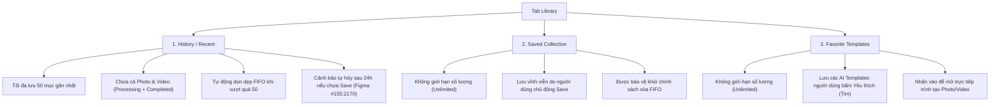
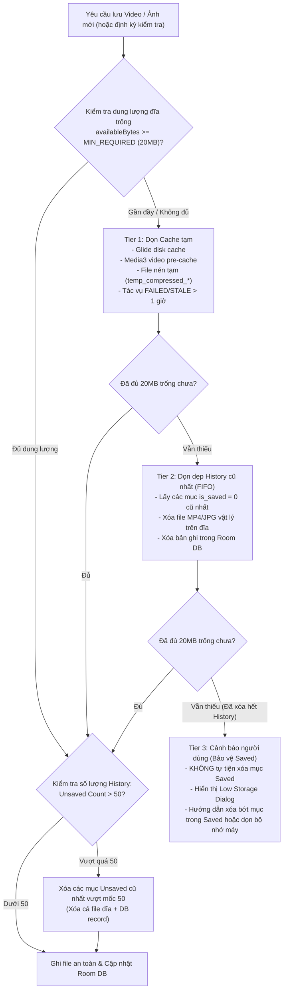

# Kế Hoạch Triển Khai: Logic Tab Library & Quản Lý Bộ Nhớ (Photo-Art)

Dự án: **893-PHOTO-ART** (Mã dự án: `893-PHOTO-ART`, App ID: `CODE12_893`)  
Kiến trúc: **MVVM + Clean Architecture + Room Database + Flow + View Binding**  
UI Framework: **Android XML Layouts + Material Design 3 (M3)** *(Tuyệt đối không Jetpack Compose)*  
Figma Design: Section "Library" (Node `#151:444`, File key `LpZ7zpoel2cIq3vER2RDTY`)  

---

## 1. TỔNG QUAN YÊU CẦU & BẢN CHẤT NGHIỆP VỤ

Tab **Library** là trung tâm quản lý tất cả tác phẩm nghệ thuật do AI tạo ra và các mẫu (templates) yêu thích của người dùng. Dựa trên luồng tạo Photo và Video đã có trong ứng dụng, Library được chia thành 3 phân vùng độc lập (3 sub-tabs):



### Các yêu cầu cốt lõi từ người dùng:
1. **History (Recent)**: Tối đa lưu **50 mục** gần nhất. Khi mục thứ 51 xuất hiện, mục cũ nhất (chưa được Save) sẽ bị xóa cả trong DB lẫn xóa file vật lý trên đĩa.
2. **Saved**: **Không giới hạn** số lượng mục. Lưu giữ an toàn, vĩnh viễn các tác phẩm người dùng bấm Save.
3. **Favorite**: **Không giới hạn** số lượng. Lưu trữ danh sách các template được người dùng thả tim trên Home / Discover.
4. **Edge case hết dung lượng (Low Storage / Out of Space)**:
   - Tự động phát hiện khi bộ nhớ máy gần đầy hoặc không đủ không gian ghi video/ảnh mới.
   - Áp dụng chính sách giải phóng theo thứ tự an toàn: **Dọn cache tạm -> Xóa History cũ nhất (FIFO)** -> Tuyệt đối bảo vệ Saved item -> Cảnh báo người dùng khi dung lượng cạn kiệt.
   - Bắt và xử lý triệt để lỗi I/O `ENOSPC (No space left on device)` để không làm crash ứng dụng.

---

## 2. THIẾT KẾ CƠ SỞ DỮ LIỆU ROOM (DATA LAYER)

Để quản lý đồng nhất cả Photo lẫn Video do AI tạo ra, ta hợp nhất và chuẩn hóa cấu trúc dữ liệu cục bộ.

### 2.1. Entity `UserCreationEntity` (Thay thế/Nâng cấp `SavedVideoEntity`)
Bảng: `user_creations`

| Trường | Kiểu dữ liệu | Ý nghĩa |
| :--- | :--- | :--- |
| `id` | `String` (PK) | Mã định danh duy nhất (UUID hoặc requestId từ AI SDK) |
| `media_type` | `String` | `"PHOTO"` hoặc `"VIDEO"` |
| `template_code` | `String` | Mã template AI sử dụng |
| `template_name` | `String` | Tên hiển thị của template |
| `original_image_path` | `String?` | Đường dẫn ảnh input gốc người dùng chọn |
| `local_media_path` | `String?` | Đường dẫn file MP4/JPG đã tải về máy (`filesDir/saved_creations/...`) |
| `remote_media_url` | `String?` | URL CDN kết quả trả về từ server |
| `thumbnail_path` | `String?` | Đường dẫn ảnh thumbnail hiển thị trên card |
| `duration` | `String` | Thời lượng video (`"5"`, `"8"`, `"10"`) hoặc rỗng cho ảnh |
| `aspect_ratio` | `String` | Tỉ lệ (`"9:16"`, `"16:9"`, `"1:1"`) |
| `prompt` | `String?` | Prompt AI người dùng đã nhập |
| `status` | `String` | Trạng thái: `"PROCESSING"`, `"COMPLETED"`, `"FAILED"` |
| `is_saved` | `Boolean` | `false`: Nằm trong History; `true`: Đã lưu vào Saved Collection |
| `is_viewed` | `Boolean` | Đã mở xem hay chưa (dùng cho In-app Notification / Auto-open) |
| `file_size_bytes` | `Long` | Dung lượng file vật lý trên đĩa (bytes), phục vụ tính toán dọn dẹp |
| `created_at` | `Long` | Timestamp tạo (Index DESC) |
| `saved_at` | `Long?` | Timestamp khi người dùng bấm Save vào Collection |

### 2.2. Entity `FavoriteTemplateEntity`
Bảng: `favorite_templates`

| Trường | Kiểu dữ liệu | Ý nghĩa |
| :--- | :--- | :--- |
| `template_code` | `String` (PK) | Mã code của template |
| `name` | `String` | Tên template |
| `description` | `String` | Mô tả ngắn |
| `image_url` | `String` | URL ảnh poster đại diện |
| `video_url` | `String?` | URL video demo (nếu có) |
| `video_thumbnail_url` | `String?` | URL video thumbnail |
| `category_code` | `String` | Mã danh mục |
| `category_name` | `String` | Tên danh mục |
| `template_type` | `String` | `"EDIT_IMAGE"`, `"GENERATE_VIDEO"`, `"GENERATE_STATIC_VIDEO"` |
| `favorited_at` | `Long` | Timestamp khi bấm yêu thích (Index DESC) |

### 2.3. Quy định DAO & Truy vấn hiệu năng cao
```kotlin
@Dao
interface UserCreationDao {
    // 1. History: Lấy tối đa 50 item gần nhất
    @Query("SELECT * FROM user_creations ORDER BY created_at DESC LIMIT 50")
    fun getRecentHistory(): Flow<List<UserCreationEntity>>

    // 2. Saved: Lấy toàn bộ tác phẩm đã được lưu (không giới hạn)
    @Query("SELECT * FROM user_creations WHERE is_saved = 1 ORDER BY saved_at DESC, created_at DESC")
    fun getSavedCreations(): Flow<List<UserCreationEntity>>

    // 3. Đếm số lượng item trong History chưa được lưu
    @Query("SELECT COUNT(*) FROM user_creations WHERE is_saved = 0")
    fun getUnsavedHistoryCount(): Int

    // 4. Lấy danh sách item cũ nhất trong History chưa được Save để thực hiện xoay vòng FIFO
    @Query("SELECT * FROM user_creations WHERE is_saved = 0 ORDER BY created_at ASC LIMIT :count")
    fun getOldestUnsavedCreations(count: Int): List<UserCreationEntity>

    // 5. Cập nhật trạng thái Save to Collection
    @Query("UPDATE user_creations SET is_saved = 1, saved_at = :savedAt WHERE id = :id")
    fun markAsSaved(id: String, savedAt: Long = System.currentTimeMillis()): Int

    // 6. Xóa khỏi Saved (nếu xóa hẳn hoặc chuyển lại thành unsaved)
    @Query("UPDATE user_creations SET is_saved = 0 WHERE id = :id")
    fun removeFromSaved(id: String): Int

    // 7. Xóa hoàn toàn bản ghi
    @Query("DELETE FROM user_creations WHERE id = :id")
    fun deleteById(id: String): Int
}
```

---

## 3. CHIẾN LƯỢC QUẢN LÝ DUNG LƯỢNG & XỬ LÝ EDGE CASE HẾT BỘ NHỚ (STORAGE EVICTION POLICY)

### 3.1. Phân cấp giải phóng bộ nhớ (Storage Eviction Waterfall)
Bộ nhớ lưu trữ video và ảnh AI nằm trong thư mục nội bộ `context.filesDir/saved_creations/`. Khi cần ghi file mới hoặc khi hệ thống phát cảnh báo dung lượng thấp, quy trình dọn dẹp diễn ra tuần tự:



### 3.2. Bảng Ngưỡng Dung Lượng (Threshold Rules)
| Thông số | Giá trị | Mục đích |
| :--- | :--- | :--- |
| `MIN_FREE_SPACE_BYTES` | `20 * 1024 * 1024L` (20MB) | Ngưỡng an toàn tối thiểu trước khi bắt đầu tải/lưu một video mới |
| `CRITICAL_FREE_SPACE_BYTES` | `50 * 1024 * 1024L` (50MB) | Ngưỡng hiển thị cảnh báo bộ nhớ thấp trên giao diện |
| `MAX_HISTORY_ITEMS` | `50` | Giới hạn cứng số lượng tác phẩm trong tab Recent |
| `UNSAVED_TTL_MS` | `24 * 60 * 60 * 1000L` (24 giờ) | Thời gian tồn tại của video/ảnh chưa lưu theo thiết kế Figma |

### 3.3. Xử lý triệt để lỗi I/O & File Orphan (Rác đĩa)
1. **Bắt lỗi `IOException: ENOSPC`**:
   - Khi ghi stream file MP4/JPG, nếu gặp ngoại lệ đầy đĩa (`ENOSPC`), lập tức:
     1. Đóng stream và xóa ngay lập tức file dở dang (partial file `0.part` hoặc `temp.mp4`).
     2. Kích hoạt dọn dẹp cấp tốc 5 mục History cũ nhất.
     3. Thử lại ghi (retry 1 lần). Nếu vẫn thất bại, cập nhật trạng thái `FAILED` và hiển thị thông báo lỗi thân thiện: *"Không đủ bộ nhớ để lưu video. Vui lòng giải phóng dung lượng thiết bị."*
2. **Chống rò rỉ File Orphan khi xóa Record**:
   - Mọi thao tác xóa record khỏi Room Database **bắt buộc phải đi kèm thao tác xóa file vật lý**:
   ```kotlin
   fun deleteCreationWithFile(creation: UserCreationEntity) {
       creation.localMediaPath?.let { path ->
           val file = File(path)
           if (file.exists()) file.delete()
       }
       creation.originalImagePath?.let { path ->
           // Chỉ xóa nếu ảnh gốc nằm trong thư mục nội bộ do app copy
           if (path.startsWith(context.filesDir.absolutePath)) {
               File(path).delete()
           }
       }
       dao.deleteById(creation.id)
   }
   ```

---

## 4. TÍCH HỢP VỚI LOGIC TẠO ẢNH / VIDEO ĐÃ CÓ

### 4.1. Luồng Tạo Video (AI Video Generation)
Hiện tại `AiProcessingDialogFragment` đã xử lý tạo video và lưu vào Room DB. Cần chuẩn hóa:
1. Khi gửi request tạo video:
   - Ghi nhận vào DB với `media_type = "VIDEO"`, `status = "PROCESSING"`, `is_saved = false`.
   - Card video xuất hiện ngay lập tức trong tab **Recent** với hiệu ứng quay spinner + chữ "Processing...".
2. Khi video hoàn thành:
   - Tải file MP4 về thư mục nội bộ `filesDir/saved_creations/`.
   - Cập nhật `status = "COMPLETED"`, `local_media_path = ...`, `file_size_bytes = file.length()`.
   - Kiểm tra `enforceHistoryLimit(50)` và `ensureStorageSafety()`.
3. Khi người dùng bấm Save trên màn hình `VideoResultActivity`:
   - Gọi `markAsSaved(requestId)`. Tác phẩm lập tức chuyển từ danh thái Unsaved sang xuất hiện trong cả tab **Saved**!

### 4.2. Luồng Tạo Ảnh (AI Photo Generation)
Hiện tại Photo generation chỉ hiển thị ở `PhotoResultActivity` mà chưa được lưu vào Library. Cần bổ sung:
1. Khi bắt đầu xử lý ảnh trong `AiProcessingDialogFragment`:
   - Tạo bản ghi trong DB với `media_type = "PHOTO"`, `status = "PROCESSING"`, `is_saved = false`.
2. Khi xử lý thành công:
   - Tải và lưu ảnh kết quả vào `filesDir/saved_creations/photo_<timestamp>.jpg`.
   - Cập nhật `status = "COMPLETED"`, `local_media_path = ...`.
   - Card ảnh xuất hiện trong tab **Recent**.
3. Người dùng bấm Save ở `PhotoResultActivity`:
   - Đánh dấu `is_saved = true` trong Room DB + Lưu vào Gallery (MediaStore) của máy.

### 4.3. Luồng Yêu Thích Mẫu (Favorite Templates)
1. Thêm nút icon Trái tim (Heart) vào các Card Template trên màn hình **Home** (`HomeFragment`), **Discover** (`DiscoverFragment`) và **Create Video / Photo**.
2. Khi người dùng bấm Trái tim:
   - Thêm/Xóa khỏi bảng `favorite_templates`.
   - Tab **Favorite** trong Library lắng nghe Flow từ Room DB và tự động cập nhật danh sách hiển thị với độ trễ 0ms.

---

## 5. THIẾT KẾ GIAO DIỆN (UI/UX) BÁM SÁT FIGMA

Giao diện tab Library đã có khung Scaffold, Segmented Pill Control và Empty States. Cần kết nối và hoàn thiện:

### 5.1. Bố cục RecyclerView (2-Column Responsive Grid)
- Sử dụng `GridLayoutManager(context, 2)` kết hợp `ItemDecoration` tạo khoảng cách chuẩn:
  - Lề ngoài màn hình: `16dp` (`@dimen/spacing_l`).
  - Khoảng cách giữa 2 cột: `16dp` (Figma `#151:1103`).
  - Khoảng cách giữa các hàng: `16dp`.

### 5.2. Cấu trúc Item Card cho từng Tab:
1. **Tab Recent (History)**:
   - **Header Banner**: Khung cảnh báo kính mờ (Figma `#155:2170`) với icon `info-circle` và văn bản:
     *"The unsaved videos will be deleted in 24 hours. Save them to your permanent collection to keep them forever."*
   - **Card Item Processing**: Hiển thị ảnh gốc mờ, lớp phủ gradient đen, icon xoay và nhãn `"Processing..."` (Figma `#24:6738`).
   - **Card Item Completed**: Hiển thị thumbnail, góc trên bên phải có nút kính mờ 3 chấm (`bi:three-dots`), bên dưới là tên Template (`tvTemplateTitle`).
   - **Action khi bấm 3 chấm**: Mở `CreationActionBottomSheet` (Figma `#299:682`):
     - `Save to Collection` (Icon Bookmark)
     - `Download Photo/Video` (Icon Download)
     - `Delete Photo/Video` (Màu đỏ `#FF494C`)
2. **Tab Saved**:
   - Không có Header Banner.
   - Hiển thị danh sách các tác phẩm đã lưu (`is_saved = true`).
   - Nút 3 chấm mở `CreationActionBottomSheet` (Figma `#184:1033`):
     - `Download Photo/Video`
     - `Report Photo/Video`
     - `Delete from Saved`
3. **Tab Favorite**:
   - Hiển thị danh sách các AI Template yêu thích.
   - Góc trên bên phải có nút kính mờ hình **Trái tim màu hồng/gradient active** (Figma `#155:2234`).
   - Bấm vào Trái tim -> Bỏ yêu thích (Unfavorite với animation mượt).
   - Bấm vào thân Card -> Mở `CreateVideoActivity` (nếu là video template) hoặc `CreatePhotoActivity` (nếu là photo template) kèm template được chọn sẵn.

---

## 6. LỘ TRÌNH TRIỂN KHAI TỪNG BƯỚC (STEP-BY-STEP IMPLEMENTATION PLAN)

```mermaid
gantt
    title Lộ trình triển khai Logic Tab Library
    dateFormat  X
    axisFormat %d

    section Phase 1: Data & Storage
    Nâng cấp Room Entity & DAOs (UserCreation & FavoriteTemplate) :active, p1_1, 0, 1
    Xây dựng LibraryStorageManager (Eviction, FIFO 50, Free Space) :p1_2, after p1_1, 1

    section Phase 2: Repository Layer
    Xây dựng LibraryRepository & đồng bộ dữ liệu :p2_1, after p1_2, 1
    Tích hợp Hook từ AiProcessingDialogFragment & Result Screen :p2_2, after p2_1, 1

    section Phase 3: UI & Presentation
    Xây dựng CreationAdapter & FavoriteAdapter (2-column Grid) :p3_1, after p2_2, 1
    Triển khai CreationActionBottomSheet (Figma #299:682, #184:1033) :p3_2, after p3_1, 1
    Cập nhật LibraryViewModel & LibraryFragment :p3_3, after p3_2, 1

    section Phase 4: Edge Cases & Verification
    Xử lý kiểm tra bộ nhớ thấp & thông báo người dùng :p4_1, after p3_3, 1
    Kiểm thử Unit Test & End-to-End :p4_2, after p4_1, 1
```



### Chi tiết các bước thực hiện:

#### Bước 1: Nâng cấp Room Database & Storage Manager
- Đổi tên hoặc mở rộng `SavedVideoEntity` thành `UserCreationEntity` với đầy đủ các trường (`media_type`, `is_saved`, `file_size_bytes`, v.v.).
- Tạo entity `FavoriteTemplateEntity` và DAO `FavoriteTemplateDao`.
- Cập nhật `AppDatabase.kt` (tăng version, cung cấp migration an toàn).
- Tạo `LibraryStorageManager` tại `data/local/storage/LibraryStorageManager.kt`:
  - `checkAvailableSpaceBytes(): Long`
  - `ensureSpaceForNewMedia(estimatedBytes: Long): Boolean`
  - `evictOldestUnsavedHistory(countToEvict: Int)`
  - `enforceHistoryLimit(maxCount: Int = 50)`
  - `deleteMediaFiles(creation: UserCreationEntity)`

#### Bước 2: Xây dựng Repository & Tích hợp luồng tạo AI
- Tạo `LibraryRepository` và `LibraryRepositoryImpl`:
  - Quản lý Flow cho Recent, Saved, Favorite.
  - Cung cấp các hàm nghiệp vụ: `saveToCollection`, `removeFromSaved`, `deleteCreation`, `toggleFavoriteTemplate`.
- Cập nhật `AiProcessingDialogFragment`:
  - Khi bắt đầu tạo Photo/Video -> Ghi nhận bản ghi `PROCESSING` vào `UserCreationDao`.
  - Khi hoàn thành -> Tải file về thư mục nội bộ và cập nhật `COMPLETED`.
- Cập nhật `VideoResultActivity` & `PhotoResultActivity`:
  - Nút Save liên kết trực tiếp với `LibraryRepository.saveToCollection()`.

#### Bước 3: Hoàn thiện UI & ViewModel cho Library
- Cập nhật `LibraryViewModel`:
  - Expose StateFlow cho `recentCreations`, `savedCreations`, `favoriteTemplates`.
  - Quản lý logic phân tab, xóa, lưu, tải về.
- Tạo `CreationAdapter` (phục vụ tab Recent và Saved):
  - Hỗ trợ ViewType cho `PROCESSING` state và `COMPLETED` state.
  - Hiển thị thumbnail bằng Glide với cache local mượt mà.
  - Xử lý click item và click nút 3-dots.
- Tạo `FavoriteTemplateAdapter` (phục vụ tab Favorite):
  - Hiển thị template card, poster, title, và nút tim.
- Tạo `CreationActionBottomSheet`:
  - Sử dụng chuẩn `BaseAppBottomSheetDialogFragment` kế thừa phong cách Dark Glassmorphism.
  - Phân loại menu theo ngữ cảnh (Recent vs Saved).
- Kết nối `LibraryFragment`:
  - Điều khiển ẩn/hiện giữa RecyclerView và Empty State theo trạng thái dữ liệu rỗng của từng tab.
  - Tích hợp Header Info Banner cho tab Recent.

#### Bước 4: Xử lý Edge Cases & Kiểm thử toàn diện
- **Kiểm thử Giới hạn 50**: Tạo liên tiếp > 50 item mẫu, xác nhận các item cũ nhất (chưa save) bị loại bỏ đúng thứ tự FIFO cả trong DB lẫn đĩa.
- **Kiểm thử Saved Không Giới Hạn**: Lưu các item, kiểm tra các item này không bị ảnh hưởng khi History bị xóa.
- **Kiểm thử Hết Dung Lượng**:
  - Mô phỏng dung lượng thấp (`availableBytes < 20MB`), kiểm tra cơ chế kích hoạt Tier 1 (xóa cache) và Tier 2 (xóa history cũ).
  - Kiểm tra dialog cảnh báo khi bộ nhớ cạn kiệt.
  - Xác nhận không xảy ra crash `IOException` khi ghi file.
- **Kiểm thử Tương tác Tab**: Chuyển đổi giữa Recent, Saved, Favorite mượt mà, lưu vị trí cuộn và không giật lag.
